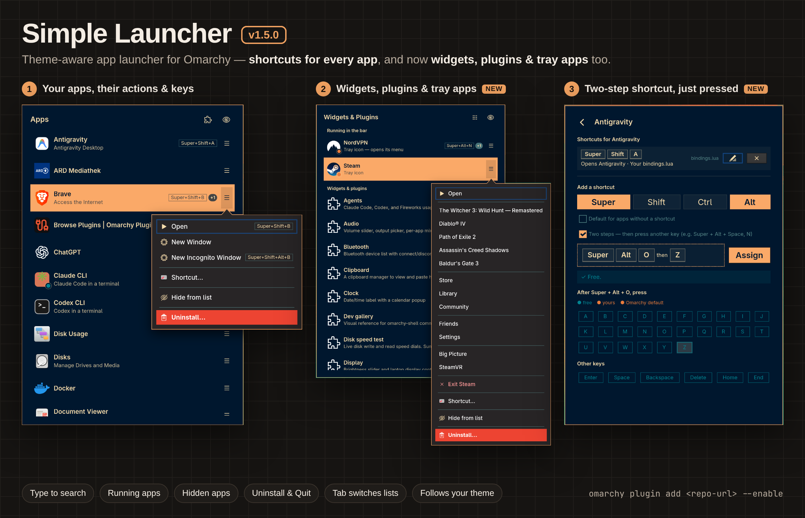

# Simple Launcher

Fast, theme-aware application launcher popup and bar widget for [Omarchy](https://omarchy.org) — with an advanced shortcut editor: bind keys to apps **or their actions**, see who owns every key, and rebind any of them in one click.



**New in 1.5:** put widgets into the bar (left, center or right) or take them out, right from the widget list.

**New in 1.4:** a second list for Omarchy **widgets, plugins and running tray apps** (Steam, NordVPN, LM Studio, …) with their own menus and shortcuts, **Uninstall** for marketplace plugins, **Quit** for background apps, **two-step shortcuts** (`Super + Alt + Space`, then `N`), keys captured just by pressing them, and separate keys for the app list and the widget list.

## Advanced shortcuts

Open an app's menu (`☰`, `→`) → **Shortcut…**, or press `Ctrl+K`.

- **Shortcuts for app actions**: a key can open the app or one of its own desktop actions. Example: give Brave's **New Incognito Window** `Super + Shift + Alt + B`. The `☰` menu shows each action's shortcut next to it.
- **Every key, coloured by owner**: with modifiers selected, all letters and keys like Enter or Space are shown — green when free, yellow when one of your bindings has it, orange for an Omarchy default.
- **One-click rebinding**: taking over a key is an option, not an error. **Rebind** turns the old binding off while your shortcut exists; remove the shortcut and the original works again.
- **All shortcuts of an app in one place**: launcher-made ones, your own `bindings.lua` binds and Omarchy defaults (including your default terminal, browser and editor, e.g. `Super + Enter` → Foot). Change, remove or turn off any of them; a `+1` badge in the list shows apps with more than one.
- **No duplicates, no edits to your files**: a key that already opens the same thing is never added twice. Everything lives in a generated `~/.config/hypr/simple-launcher-shortcuts.lua`, validated with `hyprctl configerrors` and rolled back if Hyprland rejects it.

## Changes in 1.5.0

**Bar placement from the widget list.** Every widget with something to open is listed, in the bar or not. Bar parts with nothing to open — Workspaces, System tray, Indicators, Keyboard layout, or widgets like Simple Recipes whose icon only runs a command — are not listed at all. A widget's `☰` menu has **Remove from bar** or **Add to bar ›**, which asks for the section — **Left**, **Center** or **Right**, the widget's own default marked (Omarchy's `omarchy plugin disable` / `enable <id> <section>`); widgets that are not in the bar count as hidden: they show (dimmed, marked *Not in bar*) only while the eye shows hidden entries, so a removed widget leaves the list and comes back with **Add to bar**. Simple Launcher's own entry always stays. A widget out of the bar has no **Open** and no **Shortcut…** until it is back, because its panel opens from its bar button. **Hide from list** stays separate: it only hides the entry in the launcher.

## Changes in 1.4.1

New marketplace preview and description that show the app list first. No code changes.

## Changes in 1.4.0

A second list for Omarchy shell **widgets & plugins** (Audio, Bluetooth, Clipboard, Emojis, Weather, Omamail, …). The puzzle-piece button next to the eye switches between apps and widgets (or press `Tab`); the grid button switches back. The widget list has its own show-hidden toggle, and its `☰` menu works like the app menu: **Open**, **Shortcut…** (`Ctrl+K`) and **Hide from list**. A widget shortcut toggles it like Omarchy's own `Super + Ctrl + V` does for the clipboard, and Omarchy defaults like that one show up on the shortcut page. Only plugins the shell can open are listed; bar widgets that just run a command when clicked are left out. Hidden widgets are saved in `~/.config/applauncher/hidden-plugins.json`.

Running **tray icons** (Steam, NordVPN, LM Studio, Antigravity, …) are listed first in the same list, under **Running in the bar** (apps like Steam stay in the app list too). Electron apps share a generic tray Id, so their icons are told apart by title. Icons without a primary action of their own (Steam) open their app instead. Their `☰` menu is the icon's own tray menu, submenus included (NordVPN's country list scrolls, **Back** goes up a level), with checkmarks for toggles. Enter or a click opens the app (Steam's window); icons that are only a menu, like NordVPN, open their menu instead. **Shortcut…** can bind the icon or any entry of its menu, e.g. `Super + Alt + L` → Steam › Library; the shortcut runs `tray.py <id> <entry>`, which finds the icon again after the app restarts. An entry whose label changes (NordVPN's *Secure my connection* while connected) only works while it carries that label.

Apps that run in the background or in the tray get **Quit** in their app menu (next to **Close**, which only closes windows): it uses the app's own tray entry (*Quit LM Studio*, *Exit Steam*) for a clean exit, or ends the process of a windowless background app. In a tray icon's own menu its Quit entry stays pinned below long lists.

Installed plugins — from the marketplace, `omarchy plugin add` or linked — have **Uninstall…** in their menu, like apps; Omarchy's built-in ones do not. It runs `omarchy plugin remove`, which disables the plugin, unloads it and removes its folder (plain folders are kept as a backup, links are only unlinked). Git checkouts are deleted, so the confirmation says when that would lose work: changed files, unpushed commits, or a repo without upstream. Launcher shortcuts of a removed plugin are dropped. A tray icon's **Uninstall…** uninstalls its app (Steam).

New plugins show up in the open list on their own, like newly installed apps: the launcher watches `~/.config/omarchy/plugins` and the shell's `shell.json`, and tray icons appear and disappear as their apps start and quit.

**Just press the keys**: while the shortcut page is open, the launcher switches Hyprland to an empty submap, so every combo reaches the page — even ones Hyprland or Omarchy already use (e.g. `Super + Alt + Space`, the Apps menu) — instead of running. Leaving the page switches back; `Super + Escape` does too, should the launcher ever fail to. Press a combo, then within about a second a key on its own, and it becomes a two-step shortcut automatically.

**Two-step shortcuts**: tick **Two steps** on the shortcut page, choose the first combo (e.g. `Super + Alt + Space`), then the second key on its own (e.g. `N`) — press it or click a letter; a second click clears it, like every key button. Several shortcuts can share a first combo, each with its own second key; the letters show which second keys are free. The first combo enters a Hyprland submap where the second key runs the shortcut and any other key cancels. A first combo cannot open anything by itself, so it conflicts with one-step shortcuts on the same keys (shown and rebindable like any other conflict).

**Simple Launcher** itself is in the widget list too: Enter or **Shortcut…** opens its shortcut page, so the keys that open the launcher are set the same way as any app's.

Its `☰` menu has **Show apps** and **Show widgets & plugins**, and on the shortcut page **Opens** offers the same choice, so each list can get its own key (e.g. `Super + Alt + A` for apps, `Super + Alt + W` for widgets). Such a key opens the launcher on that list, switches an open launcher over to it, and closes it when that list is already showing. By hand: `launcher-toggle apps` or `launcher-toggle plugins`.

## Changes in 1.3.5

The shortcut page has no visible scrollbar (wheel, touchpad and keyboard scrolling still work) and uses the same left and right gaps as the app list. **Assign** now sits beside the key being defined instead of below all keys.

## Changes in 1.3.4

Adding a shortcut always starts from the default modifiers (Super + Shift unless changed with **Default for apps without a shortcut**), also for apps that already have one, and after cancelling a change.

## Changes in 1.3.3

The app list no longer shows a scrollbar; wheel, touchpad and keyboard scrolling still work. The app-menu buttons and the show/hide hidden-apps button now share one column, with the same gap to the right edge as the app icons have to the left.

## Changes in 1.3.2

Open app menus survive background running-status updates, app-directory refreshes, and temporary focus loss. Escape closes the app menu before clearing search or dismissing the launcher.

## Features

- **Omarchy Bar Widget**: Sits natively in the Quickshell top bar as an app-grid button. Click to toggle the launcher on and off.
- **Wayland Layer-Shell Overlay**: Built on GTK4 Layer Shell for zero-latency, buttery-smooth appearance above all windows.
- **Theme Harmony**: Automatically loads and syncs with Omarchy's active theme palette (`~/.local/state/omarchy/current/theme/colors.toml`). Accent colors, selections, and background match your desktop styling dynamically.
- **Instant Search**: Start typing anywhere to immediately filter applications. Supports backspace and Escape to clear.
- **Running App Tracking**: Inspects Hyprland client states and running processes in real-time. A badge on the app icon shows green for open windows and amber for apps running in the background, so shortcut badges stay aligned. Terminal apps such as `foot -e claude` count as their own app, not as the terminal.
- **PWA & AppImage Support**: Automatically scans `.desktop` files, Chromium/Chrome Progressive Web Apps (PWAs), and standalone AppImage executables.
- **Hidden Apps Management**: Conceal distracting helper tools or background daemons from the launcher view with one click, or toggle visibility with the top-right eye icon.
- **Uninstall**: The last item of an app's actions menu asks “Do you want to uninstall …?” like Omarchy's menu, then runs `omarchy-remove-launcher-entry`, which removes web apps and TUIs, deletes your own launcher entries, and uninstalls packages (pacman, in a terminal) or Flatpaks.
- **Always Current**: Apps are re-read on every open, and the open list refreshes when apps are installed or removed. Shortcuts of uninstalled apps are dropped (with a notification), so their keys work again. After a plugin update the launcher restarts itself with the new code on the next open.
- **App Shortcuts**: Bind a global Hyprland shortcut to any app from its actions menu (`Shortcut…` or `Ctrl+K`). Every key shows who has it; taken keys — your own bindings or Omarchy defaults — can simply be rebound, and come back when the shortcut is removed.
- **Lightweight & Self-Contained**: Powered by standard system Python and GIO/GTK4. No heavy background virtual environments needed.

Standalone AppImage metadata is limited to 64 KiB. Icons are extracted through a bounded pipe with a 1 MiB limit before being saved atomically in the cache. Oversized, timed-out, or failed icon extractions use the generic application icon. The archive extractor never writes icons directly to disk.

Desktop entries launch through `uwsm-app` or Gio using the original desktop file. If native launching fails, the launcher reports failure; it never executes the entry’s `Exec` text through a shell.

## Installation

Requires Python with PyGObject, GTK4 and GTK4 Layer Shell, plus an Omarchy/Hyprland Wayland session. All of these come with a standard Omarchy install, so no manual setup is needed. Optional `7z` support extracts AppImage metadata and icons.

The **Uninstall…** action calls Omarchy's existing launcher-entry removal command only after confirmation; that command can invoke package management and request privileges in a terminal. The plugin adds no automatic installer or background package-management action.

Install using the Omarchy plugin manager:

```bash
omarchy plugin add https://github.com/ubruckhaus/omarchy-simple-launcher-for-fools.git --enable
```

Or install locally:

1. Clone or copy into `~/.config/omarchy/plugins/ubruckhaus.simple-launcher-for-fools/`
2. Enable via the Omarchy CLI:
   ```bash
   omarchy plugin enable ubruckhaus.simple-launcher-for-fools
   ```

## Keybindings (Optional)

The easiest way: switch to **Widgets & Plugins** (`Tab`), select **Simple Launcher** and press Enter (or `☰` → **Shortcut…**). Assign one or more keys there; a binding you already wrote by hand shows up too and can be changed or turned off like any other.

To bind it by hand instead (such as `SUPER + SPACE`), add the following to `~/.config/hypr/bindings.lua`:

```lua
o.bind("SUPER, SPACE", "Simple Launcher", "~/.config/omarchy/plugins/ubruckhaus.simple-launcher-for-fools/launcher-toggle")
```

`launcher-toggle apps` and `launcher-toggle plugins` open a specific list.

Or for `SUPER + CTRL + ALT + SPACE`:

```lua
o.bind("SUPER + CTRL + ALT + SPACE", "Simple Launcher", "~/.config/omarchy/plugins/ubruckhaus.simple-launcher-for-fools/launcher-toggle")
```

## App Shortcuts

Open an app's actions menu and choose **Shortcut…** (or press `Ctrl+K`). The top of the page lists the app's shortcuts, with a tag showing where each comes from (`Launcher`, your config file, or `Omarchy` for active Omarchy defaults such as `Super + Shift + Y` for YouTube or `Super + Shift + F` for Files). The same shortcuts appear as a badge next to each app in the list. **×** removes a launcher shortcut, or turns off a shortcut from your config; turned-off ones stay listed with **Turn on**. Below, under **Add a shortcut**, toggle modifiers and press a key, or click a letter: with modifiers selected, every letter A–Z is shown, green when free, yellow when your own binding or another launcher shortcut has it, orange for an Omarchy default (the tooltip names it) — taken keys can be rebound too. The **Other keys** are coloured the same way. Without modifiers, a few free combinations are suggested. Apps with a shortcut start with its modifiers; others start with your default (Super + Shift), which the **Default for apps without a shortcut** checkbox changes (saved in `~/.config/applauncher/settings.json`). **Assign** stays disabled until you choose a key. Non-letter keys work too: press them with the modifiers held (e.g. `Super + Ctrl + Enter`; Enter alone assigns), or click one under **Other keys** (Enter, Space, Backspace, Delete, Home, End) to combine it with the selected modifiers.

A shortcut can open the app or one of its own desktop actions, such as **New Incognito Window** in Chrome or Brave: pick it under **Opens** (shown for apps that have actions). Omarchy defaults that open your default terminal, browser or editor (`Super + Enter`, `Super + Shift + Enter`, `Super + Shift + N`) belong to that app, and `Super + Shift + Alt + B` belongs to the default browser's private window. In the list, an app shows its main shortcut plus a **+N** badge for the rest; the actions menu shows each action's shortcut next to it. Click a shortcut (or its pencil) to **Change** its key or what it opens. A key that already opens the same thing is never added twice, and a launcher shortcut that only repeats a binding from your config is marked as a duplicate.

| Status | Meaning | Action |
| --- | --- | --- |
| Free (green) | Nothing uses the combo | **Assign** |
| Yours (yellow) | Your own binding uses it; it is off while the shortcut exists | **Rebind** |
| Another app (yellow) | Another launcher shortcut uses it | **Move here** |
| Omarchy (orange) | An Omarchy default uses it; it is off while the shortcut exists | **Rebind** |

Shortcuts are stored in `~/.config/applauncher/shortcuts.json` and written to `~/.config/hypr/simple-launcher-shortcuts.lua`, which is required once at the end of `~/.config/hypr/hyprland.lua` (a backup is kept as `hyprland.lua.before-simple-launcher-shortcuts`). Your other config files are never edited: replacing or unbinding a binding is an `hl.unbind` in the generated file, so removing the shortcut restores the original. Every change is validated with `hyprctl configerrors` and rolled back if Hyprland rejects it.

## Keyboard Navigation

| Key | Action |
| --- | --- |
| `Any letter / number` | Type to filter apps instantly |
| `Up` / `Down` | Move selection through app list |
| `Page Up` / `Page Down` | Jump selection by 6 items |
| `Home` / `End` | Jump to start / end of list |
| `Return` / `Enter` | Launch selected application |
| `Backspace` | Erase search character |
| `Escape` | Clear search query, or close launcher if search is empty |
| `Right Arrow` | Open context actions menu (for apps with desktop actions) |
| `Delete` | Close active instance of the selected app |
| `Ctrl+K` | Manage the global shortcut of the selected app |
| `Tab` | Switch between the app list and the widget & plugin list |
| `Click outside` | Dismiss launcher popup |

## Removal

To remove the plugin:

```bash
omarchy plugin remove ubruckhaus.simple-launcher-for-fools
```

Hidden apps configuration is saved in `~/.config/applauncher/hidden.json` (hidden widgets in `hidden-plugins.json`) and will persist across updates.

## License

MIT License. See [LICENSE](LICENSE) for details.
